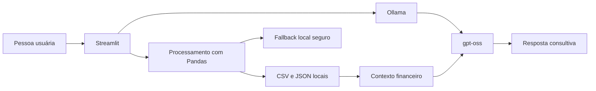

# Finan - Assistente Financeiro com IA Local

O Finan é um assistente financeiro pessoal criado para o Lab **Construa Seu Assistente Virtual Com Inteligência Artificial**, da DIO.

O projeto transforma dados financeiros organizados em CSV e JSON em um dashboard e um chat consultivo. O agente ajuda a entender gastos, cartão, metas e fluxo de caixa sem inventar informações ausentes.

## Demonstração

Na aplicação, a pessoa usuária pode:

- visualizar entradas, saídas, saldo previsto e gastos com cartão;
- identificar as categorias que mais pressionam o orçamento;
- conversar com o agente em português;
- perguntar se existe margem para guardar ou investir;
- receber alertas quando uma informação não estiver disponível;
- usar IA local com Ollama e `gpt-oss`.

**Vídeo do pitch:** [assistir ou baixar a demonstração](https://github.com/Luis1Santos1/dio-lab-bia-do-futuro/releases/download/v1.0.0/finan-pitch.mp4)

**Release da entrega:** [Finan v1.0.0](https://github.com/Luis1Santos1/dio-lab-bia-do-futuro/releases/tag/v1.0.0)

## Problema

Planilhas financeiras armazenam dados, mas nem sempre ajudam uma pessoa a tomar decisões. É comum não saber onde o dinheiro está sendo gasto, se o cartão está comprometendo o orçamento ou se existe sobra real para uma nova compra ou investimento.

## Solução

O Finan combina:

- processamento determinístico com Pandas;
- base de conhecimento local;
- prompt com regras anti-alucinação;
- modelo `gpt-oss` executado pelo Ollama;
- interface web construída com Streamlit;
- fallback baseado em regras quando a LLM não estiver disponível.

## Os 6 Passos do Desafio

| Etapa | Entrega |
|---|---|
| 1. Documentação | [Caso de uso, persona, arquitetura e segurança](docs/01-documentacao-agente.md) |
| 2. Base de conhecimento | [Estratégia e descrição dos dados](docs/02-base-conhecimento.md) |
| 3. Prompts | [System prompt, exemplos e edge cases](docs/03-prompts.md) |
| 4. Aplicação funcional | [Código Streamlit](src/app.py) e [instruções](src/README_ETAPA_4.md) |
| 5. Avaliação e métricas | [Testes e resultados](docs/04-metricas.md) |
| 6. Pitch | [Roteiro de 3 minutos](docs/05-pitch.md) |

## Arquitetura



## Base de Conhecimento

```text
data/
|-- perfil_investidor_luis_rosa.json
|-- transacoes_luis_rosa.csv
|-- historico_atendimento_luis_rosa.csv
`-- produtos_financeiros_luis_rosa.json
```

Os dados representam um cenário financeiro organizado para fins educacionais. A aplicação não acessa banco, internet banking ou saldo em tempo real.

## Como Executar

Pré-requisitos:

- Python 3.11 ou superior;
- Ollama;
- espaço disponível para o modelo local.

Instale as dependências:

```bash
python -m pip install -r src/requirements.txt
```

Baixe o modelo:

```bash
ollama pull gpt-oss
```

Crie um `.env` na raiz ou use o arquivo já configurado localmente:

```env
LLM_PROVIDER=ollama
OLLAMA_BASE_URL=http://localhost:11434/v1
OLLAMA_MODEL=gpt-oss
OLLAMA_REASONING_EFFORT=none
LLM_MAX_TOKENS=300
```

Execute:

```bash
python -m streamlit run src/app.py
```

Acesse `http://localhost:8501`.

## Perguntas Para Demonstração

```text
Como está minha situação financeira esse mês?
Onde estou gastando mais?
Meu cartão está muito alto?
Posso investir esse mês?
Qual é meu patrimônio total?
Qual a previsão do tempo para amanhã?
```

As duas últimas perguntas demonstram o comportamento anti-alucinação e a restrição de escopo.

## Testes

Execute:

```bash
python -m unittest discover -s tests -v
```

Resultado atual:

```text
6 testes executados
6 testes aprovados
```

Os testes verificam:

- carregamento dos quatro arquivos da base;
- filtro correto de junho de 2026;
- totais de entradas, saídas e saldo;
- formatação monetária brasileira;
- recusa de perguntas fora do escopo;
- proteção contra pedidos de senha;
- tratamento de informação ausente.

## Segurança e Limitações

- Não inventa valores ausentes.
- Não solicita ou revela senhas e credenciais.
- Não realiza movimentações bancárias.
- Não promete rentabilidade.
- Não substitui consultoria financeira profissional.
- Não trata os arquivos como saldo bancário em tempo real.
- Prioriza organização financeira antes de investimentos.

## Tecnologias

- Python
- Streamlit
- Pandas
- Ollama
- gpt-oss
- OpenAI Python SDK, usado como cliente para o endpoint compatível do Ollama

## Autor

Luis Rosa

Projeto desenvolvido como parte da formação da [Digital Innovation One](https://www.dio.me/).
