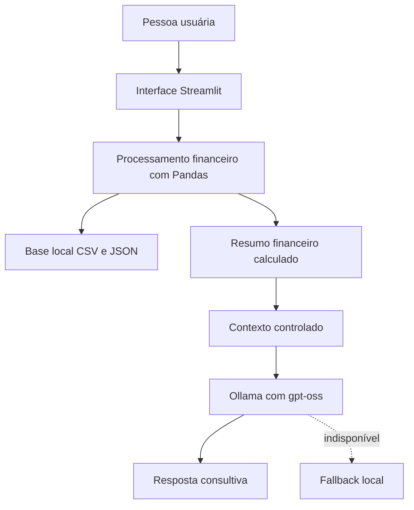

# Documentação do Agente

## Identidade

- **Nome:** Finan
- **Tipo:** Assistente financeiro pessoal
- **Idioma:** Português do Brasil
- **Tom:** direto, educativo, acessível e sem julgamentos

## Problema

Pessoas que usam planilhas financeiras nem sempre conseguem transformar os registros em decisões. Elas precisam entender rapidamente:

- se o mês fecha positivo ou negativo;
- quais categorias concentram os gastos;
- quanto o cartão pesa no orçamento;
- se existe margem para novas compras, metas ou investimentos.

## Solução

O Finan lê uma base local, calcula indicadores financeiros e responde perguntas em linguagem natural. O agente não altera os dados nem realiza transações; seu papel é analisar o cenário registrado e sugerir próximos passos prudentes.

## Público-Alvo

- Pessoas que desejam organizar o orçamento mensal.
- Usuários que já registram despesas, mas têm dificuldade de interpretação.
- Pessoas que querem acompanhar cartão, compromissos e metas.
- Iniciantes em educação financeira.

## Capacidades

- Calcular entradas, saídas e saldo do mês.
- Identificar maiores categorias de gasto.
- Analisar o peso do cartão.
- Consultar metas e compromissos registrados.
- Orientar a priorização do fluxo de caixa.
- Explicar quando não há dados suficientes.
- Recusar perguntas fora do escopo e pedidos sensíveis.

## Arquitetura

| Componente | Responsabilidade |
|---|---|
| Streamlit | Dashboard e chat |
| Pandas | Leitura, filtro mensal e cálculos |
| CSV/JSON | Base de conhecimento |
| Ollama | Execução local da LLM |
| `gpt-oss` | Geração da resposta em linguagem natural |
| Fallback | Respostas essenciais sem dependência da LLM |

## Segurança e Anti-Alucinação

- Os totais financeiros são calculados pelo código.
- O agente não inventa valores, datas, patrimônio ou saldo atual.
- Informações ausentes são declaradas como indisponíveis.
- Senhas, tokens e credenciais são recusados.
- Perguntas fora de finanças pessoais são recusadas.
- O agente não promete rentabilidade.
- Investimentos não são priorizados quando o fluxo de caixa está negativo.
- Os dados não são tratados como informação bancária em tempo real.

## Limitações

O Finan não:

- acessa contas bancárias;
- realiza pagamentos ou investimentos;
- cadastra transações pela interface atual;
- substitui profissionais de finanças, contabilidade ou direito;
- fornece garantias de retorno;
- conhece fatos que não estejam na base ou no contexto fornecido.

## Critério de Sucesso

O agente é considerado útil quando responde com números coerentes com a base, deixa claros os riscos do cenário, evita afirmar informações ausentes e propõe uma próxima ação prática.
